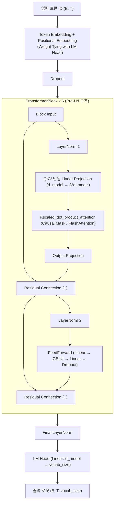

# MILM (Lightweight Transformer Decoder-Only Language Model)

PyTorch 기반의 경량 디코더 전용(Decoder-Only) 트랜스포머 언어 모델 구현체입니다. 현대적인 LLM 아키텍처(Pre-LN, Scaled Dot-Product Attention/FlashAttention, Weight Tying 등)와 학습/추론 최적화 기법, 포괄적인 평가 지표 체계(PPL, BLEU, ROUGE-L, 다중 온도 벤치마크) 및 **NVIDIA NVTX 기반 GPU 연산 프로파일링 체계**를 내장하고 있습니다.

---

## 📌 주요 특징 (Key Features)

- **현대적 트랜스포머 아키텍처**:
  - **Pre-Layer Normalization (Pre-LN)** 및 Residual Connection 구조로 깊은 네트워크에서의 학습 안정성 확보
  - `torch.nn.functional.scaled_dot_product_attention`을 통한 C++/CUDA 하드웨어 가속 Attention (FlashAttention-2 / Memory-Efficient Attention 지원)
  - 입력 임베딩(Token Embedding)과 출력 투영층(LM Head) 간 **Weight Tying** 적용으로 파라미터 절약 및 표현력 증대
  - Query, Key, Value를 단일 선형 계층으로 일괄 계산하는 **Fused QKV Projection**
  - GELU 활성화 함수 기반 FeedForward Network (FFN)
- **학습 파이프라인 최적화**:
  - Cosine Annealing with Linear Warmup 학습률 스케줄러
  - Automatic Mixed Precision (`torch.autocast` / `GradScaler`, FP16) 지원
  - `torch.compile` (PyTorch 2.0+) 커널 퓨전 및 Fused AdamW 옵티마이저 지원
  - Gradient Clipping (`max_norm=1.0`)을 통한 기울기 폭주 방지
  - Host-to-Device 비동기 전송 (`non_blocking=True`)
- **고급 디코딩 & 추론 엔진**:
  - Temperature Scaling, Top-K Filtering, Top-P (Nucleus) Filtering 지원
  - 텍스트 생성 품질 개선을 위한 Repetition Penalty (반복 페널티) 내장
- **포괄적인 정량/정성 평가 도구**:
  - Cross-Entropy Loss & Perplexity (PPL) 계산
  - n-gram 기반 BLEU-4 및 LCS 기반 ROUGE-L 유사도 평가
  - 다중 Temperature 설정에 따른 텍스트 생성 및 n-gram 반복률(Repetition Rate) 분석 벤치마크
- **정밀 GPU 프로파일링 (NVTX)**:
  - 모델 연산, 학습 스텝, 데이터 전송, 추론 및 평가 전 과정에 NVTX Range 계층 태깅 지원 (Nsight Systems / Compute 호환)

---

## 🏗️ 모델 아키텍처 (Architecture Diagram)



---

## 🗂️ 디렉토리 구조 (Directory Structure)

```text
milm/
├── config.py             # 모델(ModelConfig) 및 학습/환경(TrainConfig) 하이퍼파라미터 설정
├── config.yaml           # YAML 기반 모델/학습 하이퍼파라미터 설정 파일
├── config.yaml.template  # 사용자 환경 설정을 위한 YAML 템플릿
├── model.py              # 트랜스포머(Decoder-Only MILM) 모델 아키텍처 구현
├── dataset.py            # 문자 기반 토크나이저(CharTokenizer) 및 시퀀스 데이터셋/데이터로더 파이프라인
├── train.py              # AMP, 스케줄러, 최적화 및 모델 체크포인트 저장 학습 루프
├── infer.py              # Top-k/Top-p/온도 조절/반복 페널티 기반 고속 텍스트 생성 추론 엔진
├── evaluate.py           # PPL, BLEU, ROUGE-L, 벤치마크 스위트 정량/정성 평가 모듈
├── AGENTS.md             # 에이전트 및 개발자를 위한 저장소 개발 가이드라인
├── TRAINING_REPORT.md    # 모델 학습 결과, 손실 함수 추이 및 과적합 분석 보고서
├── ROADMAP.md            # 단계별 성능 개선 및 최신 아키텍처/최적화 로드맵
├── checkpoints/          # 최적 모델 체크포인트(best_model.pt) 및 어휘 사전(tokenizer.json)
├── data/                 # 학습 코퍼스 데이터셋 (cleaned_Harry_Potter.txt 등)
└── llm_profile.nsys-rep  # NVIDIA Nsight Systems 프로파일링 리포트 아티팩트
```

---

## 🧩 모듈별 상세 설명

| 파일명 | 주요 클래스 및 함수 | 설명 |
| :--- | :--- | :--- |
| `config.py` | `ModelConfig`, `TrainConfig`, `load_config` | `config.yaml` 파일 파싱 및 임베딩 차원, 레이어 수, 배치 크기, 학습률, AMP/Compile 설정 등을 Dataclass로 관리 |
| `config.yaml` | `model`, `train` 섹션 | 하이퍼파라미터 및 인프라 설정을 직관적으로 수정 가능한 YAML 설정 파일 |
| `model.py` | `MiniLLM`, `TransformerBlock`, `CausalSelfAttention`, `FeedForward` | Pre-LN 및 Fast Attention(SDPA), Weight Tying, Fused QKV가 적용된 Decoder-Only 트랜스포머 모델 |
| `dataset.py` | `CharTokenizer`, `TextDataset`, `create_dataloaders` | 문자 단위 어휘 사전 생성/저장/로드 및 슬라이딩 윈도우 기반 Next-Token Prediction 데이터셋 구성 |
| `train.py` | `train`, `get_lr_scheduler` | Cosine Annealing 스케줄링, FP16 AMP 학습, 검증 Loss 기반 최적 체크포인트(`checkpoints/best_model.pt`) 저장 |
| `infer.py` | `LLMInferenceEngine` | 체크포인트 로드 후 Top-k, Top-p, Repetition Penalty를 적용한 자동회귀 텍스트 생성 파이프라인 |
| `evaluate.py` | `LLMEvaluator`, `compute_bleu`, `compute_rouge_l` | 모델 검증을 위한 Perplexity(PPL), BLEU-4, ROUGE-L, 다중 온도 프롬프트 벤치마크 및 n-gram 반복률 분석 |
| `AGENTS.md` | - | 개발 환경 설정, 실행/검사 명령어, 아키텍처 경계 및 코딩 표준 지침 |
| `TRAINING_REPORT.md` | - | 데이터셋 통계, 에포크별 Train/Val Loss 추이, 과적합 분석 및 정량 평가 보고서 |
| `ROADMAP.md` | - | BPE 서브워드 토크나이저, KV Cache, RoPE, RMSNorm/SwiGLU 등 단계별 개선 과제 정의 |

---

## ⚙️ 기본 설정 (Default Hyperparameters)

```python
# ModelConfig (model.py)
vocab_size = 256   # 데이터 기반 동적 결정 (예: 105)
seq_len    = 128   # 최대 문맥 길이 (Context Window)
d_model    = 256   # 임베딩 / 히든 차원
num_heads  = 8     # Multi-Head Attention Head 수 (Head Dim = 32)
num_layers = 6     # Transformer Block 레이어 수
d_ff       = 1024  # FFN 내부 확장 차원 (4 * d_model)
dropout    = 0.1

# TrainConfig (train.py)
batch_size    = 64
epochs        = 10
learning_rate = 5e-4
min_lr        = 5e-5
warmup_steps  = 100
weight_decay  = 0.01
grad_clip     = 1.0
use_amp       = True   # Automatic Mixed Precision (FP16)
compile_model = True   # PyTorch 2.0+ torch.compile
val_split     = 0.1    # 검증 데이터셋 분할 비율
```

---

## 🚀 시작하기 (Getting Started)

### 1. 환경 준비
Python 3.8 이상 및 PyTorch가 설치되어 있어야 합니다.

```bash
# 가상환경 활성화 (필요 시)
source .venv/bin/activate
```

### 2. 모델 학습 (Training)
```bash
python train.py
```
- 학습이 완료되면 `checkpoints/` 디렉토리에 최적 모델 체크포인트(`best_model.pt`)와 어휘 사전(`tokenizer.json`)이 저장됩니다.

### 3. 텍스트 추론 및 생성 (Inference)
```bash
python infer.py
```
- 프롬프트를 입력받아 자기회귀(Autoregressive) 방식으로 다음 토큰들을 샘플링하여 텍스트를 완성합니다.

### 4. 모델 성능 평가 (Evaluation)
```bash
python evaluate.py
```
- Perplexity (PPL), BLEU-4, ROUGE-L 지표 및 Temperature별 생성 결과를 종합 평가합니다.

---

## ⚡ NVIDIA 프로파일링 (NVIDIA NVTX & Nsight Profiling)

코드베이스 전반에 **NVIDIA Tools Extension (NVTX)** 마커가 내장되어 있어, **NVIDIA Nsight Systems (`nsys`)** 및 **Nsight Compute (`ncu`)**를 사용하여 CUDA 커널 연산, H2D/D2H 메모리 복사 병목, 레이어별 연산 소요 시간을 시각적으로 정밀 분석할 수 있습니다.

### 1. NVTX 계층 구조 (NVTX Range Hierarchy)

* **모델 아키텍처 (`model.py`)**:
  * `MiniLLM::forward`
    * `Embedding_PosEncoding`: 임베딩 및 Positional Encoding 연산
    * `Block_{0..N}`: 각 트랜스포머 블록 레이어
      * `PreLN1_SelfAttention` -> `CausalSelfAttention` (`QKV_Projection`, `QKV_Reshape`, `FlashAttention_SDPA`, `Out_Projection`)
      * `PreLN2_FeedForward` -> `FeedForward`
    * `Final_LayerNorm`: 최종 레이어 정규화
    * `LM_Head`: 최종 로짓 프로젝션
* **학습 파이프라인 (`train.py`)**:
  * `Epoch_{i}` -> `Train_Step_{step}`
    * `H2D_Transfer`: CPU to GPU 텐서 비동기 전송
    * `Forward_Pass` / `Loss_Calculation`
    * `Backward_Pass`: 역전파 기울기 계산
    * `Optimizer_Step`: Grad Scaler 언스케일링, Gradient Clipping 및 가중치 업데이트
  * `Validation_Epoch` -> `Val_Step_{step}` (`Val_H2D_Transfer`, Forward)
  * `Save_Checkpoint`: 모델 가중치 직렬화
* **추론 및 평가 (`infer.py`, `evaluate.py`)**:
  * `LLM_Generate` -> `Generate_Step_{step}` (`Model_Forward`, `Repetition_Penalty`, `Sampling_TopK_TopP`)
  * `Eval::Perplexity`, `Eval::Similarity`, `Eval::Benchmark_Suite`

---

### 2. 프로파일링 실행 방법

#### 🔹 NVIDIA Nsight Systems (`nsys`) 프로파일링
전체 시스템 타임라인(CUDA 커널, NVTX 범위, 메모리 복사, CPU OS 런타임)을 프로파일링합니다.

```bash
# 1. 학습 루프 프로파일링
nsys profile \
  -t cuda,nvtx,osrt \
  -s cpu \
  --output=profile_train \
  --export=sqlite \
  python train.py

# 2. 추론 파이프라인 프로파일링
nsys profile \
  -t cuda,nvtx,osrt \
  --output=profile_infer \
  python infer.py

# 3. 특정 NVTX 범위(예: 1번 에포크)만 타겟팅하여 캡처
nsys profile \
  -t cuda,nvtx \
  -c nvtx \
  -p "Epoch_1@*" \
  --output=profile_epoch1 \
  python train.py
```

#### 🔹 NVIDIA Nsight Compute (`ncu`) 커널 정밀 분석
특정 NVTX 범위 내의 GPU 커널(예: FlashAttention / SDPA) 성능 및 메모리 대역폭을 상세 분석합니다.

```bash
# FlashAttention SDPA 커널 정밀 분석
ncu --nvtx --nvtx-include "FlashAttention_SDPA" \
  --set full \
  -o profile_sdpa_kernel \
  python train.py
```

#### 🔹 결과 시각화 (GUI)
1. 생성된 `llm_profile.nsys-rep` (또는 `profile_train.nsys-rep`) 파일을 로컬 머신으로 다운로드합니다.
2. **NVIDIA Nsight Systems GUI** 애플리케이션에서 열어 `NVTX` 타임라인 레인을 확장하면 계층별 실행 시간과 GPU 병목 구간을 확인할 수 있습니다.


