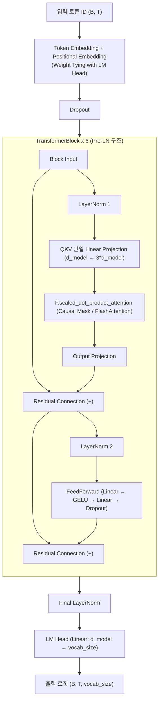

# MILM (Lightweight Transformer Decoder-Only Language Model)

PyTorch 기반의 경량 디코더 전용(Decoder-Only) 트랜스포머 언어 모델 구현체입니다. 현대적인 LLM 아키텍처(Pre-LN, Scaled Dot-Product Attention/FlashAttention, Weight Tying 등)와 학습/추론 최적화 기법, 포괄적인 평가 지표 체계(PPL, BLEU, ROUGE-L, 다중 온도 벤치마크) 및 NVIDIA NVTX 기반 GPU 연산 프로파일링 체계를 내장하고 있습니다.

---

## 주요 특징 (Key Features)

- **현대적 트랜스포머 아키텍처**:
  - **Pre-Layer Normalization (Pre-LN)** 및 Residual Connection 구조로 깊은 네트워크에서의 학습 안정성 확보
  - `torch.nn.functional.scaled_dot_product_attention`을 통한 C++/CUDA 하드웨어 가속 Attention (FlashAttention-2 / Memory-Efficient Attention 지원)
  - 입력 임베딩(Token Embedding)과 출력 투영층(LM Head) 간 **Weight Tying** 적용으로 파라미터 절약 및 표현력 증대
  - Query, Key, Value를 단일 선형 계층으로 일괄 계산하는 **Fused QKV Projection**
  - GELU 활성화 함수 기반 FeedForward Network (FFN)
- **학습 파이프라인 최적화**:
  - Cosine Annealing with Linear Warmup 학습률 스케줄러
  - Automatic Mixed Precision (`torch.autocast` / `GradScaler`, FP16) 지원
  - `torch.compile` (PyTorch 2.0+) 커널 퓨전 및 Fused AdamW 옵티마이저 지원
  - Gradient Clipping (`max_norm=1.0`)을 통한 기울기 폭주 방지
  - Host-to-Device 비동기 전송 (`non_blocking=True`)
- **고급 디코딩 & 추론 엔진**:
  - Temperature Scaling, Top-K Filtering, Top-P (Nucleus) Filtering 지원
  - 텍스트 생성 품질 개선을 위한 Repetition Penalty (반복 페널티) 내장
- **포괄적인 정량/정성 평가 도구**:
  - Cross-Entropy Loss & Perplexity (PPL) 계산
  - n-gram 기반 BLEU-4 및 LCS 기반 ROUGE-L 유사도 평가
  - 다중 Temperature 설정에 따른 텍스트 생성 및 n-gram 반복률(Repetition Rate) 분석 벤치마크
- **정밀 GPU 프로파일링 (NVTX)**:
  - 모델 연산, 학습 스텝, 데이터 전송, 추론 및 평가 전 과정에 NVTX Range 계층 태깅 지원 (Nsight Systems / Compute 호환)

---

## 모델 아키텍처 (Architecture Diagram)



---

## 디렉토리 구조 (Directory Structure)

```text
milm/
├── src/                          # 애플리케이션 코어 패키지 (Flat 레이아웃)
│   ├── __init__.py               # 패키지 공용 모듈 익스포트
│   ├── config.py                 # ModelConfig, TrainConfig 및 YAML 설정 로더
│   ├── model.py                  # MiniLLM, TransformerBlock, CausalSelfAttention, FeedForward
│   ├── dataset.py                # CharTokenizer, TextDataset, create_dataloaders
│   ├── train.py                  # 모델 학습 코어 파이프라인
│   ├── infer.py                  # 자동회귀 텍스트 생성 추론 엔진
│   └── evaluate.py               # PPL, BLEU-4, ROUGE-L 정량/정성 평가 엔진
├── tests/                        # PyTest 기반 단위/통합 테스트 스위트
│   ├── __init__.py
│   ├── test_config.py            # 설정 로딩, YAML 파싱 및 기본값 검증
│   ├── test_model.py             # 모델 Forward Pass Shape, Weight Tying 검증
│   ├── test_dataset.py           # CharTokenizer 인코딩/디코딩, TextDataset 검증
│   └── test_evaluate.py          # BLEU-4, ROUGE-L, Perplexity 계산 검증
├── docs/                         # 프로젝트 심층 분석 및 로드맵 문서
│   ├── ROADMAP.md                # 단계별 개선 과제 및 아키텍처 로드맵
│   ├── TRAINING_REPORT.md        # 모델 학습 결과, 손실 함수 추이 및 과적합 분석 보고서
│   └── AGENTS.md                 # AI 에이전트 및 개발자를 위한 가이드라인
├── scripts/                      # 자동화, CLI 실행 및 GPU 프로파일링 유틸리티
│   ├── train.py                  # 모델 학습 CLI 런처
│   ├── infer.py                  # 텍스트 생성 추론 CLI 런처
│   ├── evaluate.py               # 성능 평가 CLI 런처
│   └── profile.sh                # Nsight Systems / Compute GPU 프로파일링 자동화 스크립트
├── checkpoints/                  # 최적 가중치(best_model.pt) 및 토크나이저 아티팩트 (Git 무시)
├── data/                         # 학습용 텍스트 코퍼스 데이터 (Git 무시)
├── config.yaml                   # 로컬 모델/학습 하이퍼파라미터 설정 파일
├── config.yaml.template          # 설정 파일 템플릿 (버전 관리 대상)
├── pyproject.toml                # 패키지 메타데이터 및 빌드 설정 (pip install -e .)
├── README.md                     # 프로젝트 메인 소개 및 가이드 문서
├── AGENTS.md                     # 프로젝트 루트 AI 에이전트 규칙
└── .gitignore                    # Git 추적 제외 규칙
```

---

## 모듈별 상세 설명

| 구분 | 파일/경로 | 설명 |
| :--- | :--- | :--- |
| **코어 애플리케이션 (`src/`)** | `src/config.py` | `config.yaml` 파싱 및 `ModelConfig`, `TrainConfig` Dataclass 관리 |
| | `src/model.py` | Pre-LN, Fast Attention(SDPA), Weight Tying, Fused QKV Decoder-Only 모델 |
| | `src/dataset.py` | `CharTokenizer` 어휘 사전 직렬화 및 Next-Token Prediction 시퀀스 생성 |
| | `src/train.py` | Cosine Annealing, FP16 AMP 학습 및 검증 기반 최적 가중치 저장 |
| | `src/infer.py` | Top-k, Top-p, Repetition Penalty 기반 자동회귀 텍스트 생성 엔진 |
| | `src/evaluate.py` | PPL, BLEU-4, ROUGE-L 및 다중 온도 프롬프트 벤치마크 평가 엔진 |
| **테스트 스위트 (`tests/`)** | `tests/test_*.py` | 설정 로드, 모델 순전파/가중치 공유, 토크나이저, 평가 지표 PyTest 검증 |
| **자동화 스크립트 (`scripts/`)** | `scripts/train.py` | 모델 학습 CLI 진입점 스크립트 |
| | `scripts/infer.py` | 대화형 텍스트 생성 CLI 추론 스크립트 |
| | `scripts/evaluate.py` | 정량/정성 평가 종합 실행 스크립트 |
| | `scripts/profile.sh` | Nsight Systems (`nsys`) 및 Nsight Compute (`ncu`) 원클릭 프로파일링 |
| **문서 (`docs/`)** | `docs/ROADMAP.md` | BPE 토크나이저, KV Cache, RoPE, RMSNorm/SwiGLU 등 로드맵 |
| | `docs/TRAINING_REPORT.md` | Harry Potter 코퍼스 기준 10 에포크 학습 결과 및 과적합 분석 |

---

## 기본 설정 (Default Hyperparameters)

```yaml
# config.yaml
model:
  vocab_size: 256   # 데이터 기반 동적 결정 (예: 105)
  seq_len: 128      # 최대 문맥 길이 (Context Window)
  d_model: 256      # 임베딩 / 히든 차원
  num_heads: 8      # Multi-Head Attention Head 수 (Head Dim = 32)
  num_layers: 6     # Transformer Block 레이어 수
  d_ff: 1024        # FFN 내부 확장 차원 (4 * d_model)
  dropout: 0.1

train:
  batch_size: 64
  epochs: 10
  learning_rate: 0.0005
  min_lr: 0.00005
  warmup_steps: 100
  weight_decay: 0.01
  grad_clip: 1.0
  device: "auto"    # "auto", "cuda", "mps", "cpu"
  use_amp: true     # Automatic Mixed Precision (FP16)
  compile_model: true
  val_split: 0.1
```

---

## 시작하기 (Getting Started)

### 1. 환경 준비 및 패키지 설치
Python 3.8 이상 및 PyTorch가 설치되어 있어야 합니다.

```bash
# 가상환경 활성화 (필요 시)
source .venv/bin/activate

# 의존성 설치 (개발 모드)
pip install -e .
```

### 2. 단위 테스트 실행 (Tests)
```bash
pytest -v tests/
```

### 3. 모델 학습 (Training)
```bash
python scripts/train.py
```
- 학습이 완료되면 `checkpoints/` 디렉토리에 최적 모델 체크포인트(`best_model.pt`)와 어휘 사전(`tokenizer.json`)이 저장됩니다.

### 4. 텍스트 추론 및 생성 (Inference)
```bash
python scripts/infer.py --prompt "Harry looked at " --temp 0.7 --tokens 150
```
- 프롬프트를 입력받아 자기회귀(Autoregressive) 방식으로 다음 토큰들을 샘플링하여 텍스트를 완성합니다.

### 5. 모델 성능 평가 (Evaluation)
```bash
python scripts/evaluate.py
```
- Perplexity (PPL), BLEU-4, ROUGE-L 지표 및 Temperature별 생성 결과를 종합 평가합니다.

---

#### ⚡ 프로파일링 및 성능 분석 (PyTorch Profiler & Performance Tracing)

코드베이스 전반에 **PyTorch 통합 프로파일러(`torch.profiler.record_function`)** 마커가 내장되어 있어, macOS(CPU/MPS), Linux, Windows, NVIDIA GPU 등 모든 환경에서 추가 의존성 없이 레이어별 연산 시간, 텐서 전송 병목, 메모리 사용량을 정밀 분석할 수 있습니다.

### 1. 프로파일러 계층 구조 (Profiler Range Hierarchy)

* **모델 아키텍처 (`src/model.py`)**:
  * `MiniLLM::forward`
    * `Embedding_PosEncoding`: 임베딩 및 Positional Encoding 연산
    * `Block_{0..N}`: 각 트랜스포머 블록 레이어
      * `PreLN1_SelfAttention` -> `CausalSelfAttention` (`QKV_Projection`, `QKV_Reshape`, `FlashAttention_SDPA`, `Out_Projection`)
      * `PreLN2_FeedForward` -> `FeedForward`
    * `Final_LayerNorm`: 최종 레이어 정규화
    * `LM_Head`: 최종 로짓 프로젝션
* **학습 파이프라인 (`src/train.py`)**:
  * `Epoch_{i}` -> `Train_Step_{step}`
    * `H2D_Transfer`: CPU to GPU 텐서 비동기 전송
    * `Forward_Pass` / `Loss_Calculation`
    * `Backward_Pass`: 역전파 기울기 계산
    * `Optimizer_Step`: Grad Scaler 언스케일링, Gradient Clipping 및 가중치 업데이트
  * `Validation_Epoch` -> `Val_Step_{step}` (`Val_H2D_Transfer`, Forward)
  * `Save_Checkpoint`: 모델 가중치 직렬화
* **추론 및 평가 (`src/infer.py`, `src/evaluate.py`)**:
  * `LLM_Generate` -> `Generate_Step_{step}` (`Model_Forward`, `Repetition_Penalty`, `Sampling_TopK_TopP`)
  * `Eval::Perplexity`, `Eval::Similarity`, `Eval::Benchmark_Suite`

---

### 2. 프로파일링 실행 방법

#### 🔹 PyTorch 통합 프로파일러 활성화
`config.yaml`에서 프로파일러 설정을 켜고 학습을 실행합니다:
```yaml
train:
  profile: true
  profile_dir: "profiler_logs"
```

```bash
milm-train
```

#### 🔹 결과 시각화
* **Chrome Tracing / Perfetto**: 브라우저에서 `chrome://tracing` 또는 [ui.perfetto.dev](https://ui.perfetto.dev)에 접속한 뒤 `profiler_logs/`에 생성된 `.json` 트레이스 파일을 드래그앤드롭하여 시각화합니다.
* **TensorBoard**:
  ```bash
  tensorboard --logdir=profiler_logs
  ```
