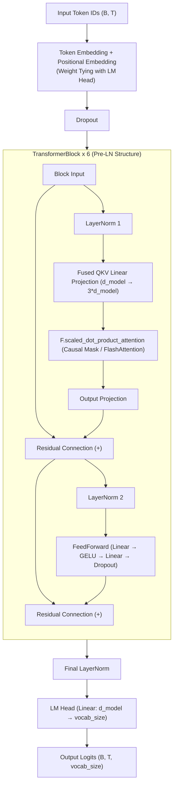

# MILM (Lightweight Transformer Decoder-Only Language Model)

A clean, modern, and lightweight PyTorch implementation of a Decoder-Only Transformer language model. Designed for LLM study, educational experimentation, and performance profiling, MILM incorporates modern LLM architecture practices (Pre-LN, Scaled Dot-Product Attention / FlashAttention, Weight Tying, Fused QKV), training & inference optimizations, comprehensive quantitative & qualitative evaluation metrics (PPL, BLEU-4, ROUGE-L, multi-temperature benchmarks), and built-in PyTorch / NVIDIA NVTX profiling hooks.

---

## Key Features

- **Modern Transformer Architecture**:
  - **Pre-Layer Normalization (Pre-LN)** with clean residual connections for stable deep network optimization.
  - Accelerated attention via `torch.nn.functional.scaled_dot_product_attention` (supporting FlashAttention-2 and Memory-Efficient Attention kernels).
  - **Weight Tying** between Token Embedding and LM Head projection to reduce parameters and improve generalization.
  - **Fused QKV Projection** to compute Query, Key, and Value representations in a single matrix multiplication.
  - FeedForward Network (FFN) with GELU activation.
- **Optimized Training Pipeline**:
  - Cosine Annealing with Linear Warmup learning rate schedule.
  - Automatic Mixed Precision (`torch.autocast` / `GradScaler`, FP16) support.
  - PyTorch 2.0+ `torch.compile` kernel fusion and fused AdamW optimizer support.
  - Gradient Clipping (`max_norm=1.0`) to stabilize gradient dynamics.
  - Non-blocking Host-to-Device asynchronous memory transfers (`non_blocking=True`).
- **Advanced Decoding & Inference Engine**:
  - Temperature Scaling, Top-K Filtering, and Top-P (Nucleus) Sampling.
  - Built-in Repetition Penalty to prevent repetitive text generation loops.
- **Comprehensive Evaluation Harness**:
  - Cross-Entropy Loss & Perplexity (PPL) calculation.
  - Character / n-gram based BLEU-4 and Longest Common Subsequence (LCS) based ROUGE-L similarity metrics.
  - Benchmark suite for evaluating multi-temperature generation and n-gram repetition rates.
- **Hierarchical Profiling Hooks (PyTorch Profiler & NVTX)**:
  - Granular range markers tagged across model forward passes, backward passes, H2D memory transfers, inference steps, and evaluation passes (compatible with PyTorch Profiler, Chrome Tracing, Perfetto, and NVIDIA Nsight Systems / Compute).

---

## Architecture Diagram



---

## Directory Structure

```text
milm/
├── src/                          # Core application package (flat layout)
│   ├── __init__.py               # Package export module
│   ├── config.py                 # ModelConfig, TrainConfig & YAML loader
│   ├── model.py                  # MiniLLM, TransformerBlock, CausalSelfAttention, FeedForward
│   ├── dataset.py                # CharTokenizer, TextDataset, create_dataloaders
│   ├── train.py                  # Core training pipeline
│   ├── infer.py                  # Autoregressive generation inference engine
│   └── evaluate.py               # PPL, BLEU-4, ROUGE-L evaluation engine
├── tests/                        # PyTest unit and integration test suite
│   ├── __init__.py
│   ├── test_config.py            # Configuration loading & YAML verification
│   ├── test_model.py             # Forward pass shapes & weight tying verification
│   ├── test_dataset.py           # CharTokenizer encoding/decoding & dataset verification
│   └── test_evaluate.py          # BLEU-4, ROUGE-L & Perplexity computation verification
├── docs/                         # In-depth analysis & roadmap documentation
│   ├── ROADMAP.md                # Architectural roadmap & improvement proposals
│   ├── TRAINING_REPORT.md        # Training report, loss curves & overfitting analysis
│   └── AGENTS.md                 # Agent guidelines
├── scripts/                      # Automation, CLI launchers & GPU profiling scripts
│   ├── train.py                  # Model training CLI launcher
│   ├── infer.py                  # Text generation inference CLI launcher
│   ├── evaluate.py               # Performance evaluation CLI launcher
│   └── profile.sh                # Nsight Systems / Compute profiling script
├── checkpoints/                  # Best model checkpoint & tokenizer artifact (Git-ignored)
├── data/                         # Training text corpora (Git-ignored)
├── config.yaml                   # Local model and training hyperparameter configuration
├── config.yaml.template          # Configuration template (tracked in Git)
├── pyproject.toml                # Package metadata and build config (pip install -e .)
├── README.md                     # Main repository introduction and usage guide
├── AGENTS.md                     # Root AI agent rules and guidelines
└── .gitignore                    # Git ignore rules
```

---

## Module Overview

| Category | File / Path | Description |
| :--- | :--- | :--- |
| **Core Package (`src/`)** | `src/config.py` | Configuration management dataclasses (`ModelConfig`, `TrainConfig`) and YAML I/O |
| | `src/model.py` | Decoder-Only Transformer with Pre-LN, Fast Attention (SDPA), Weight Tying, and Fused QKV |
| | `src/dataset.py` | `CharTokenizer` serialization and autoregressive next-token dataset slicing |
| | `src/train.py` | Training pipeline with Cosine Annealing, FP16 AMP, and best-checkpoint saving |
| | `src/infer.py` | Autoregressive generation engine with Top-k, Top-p, and Repetition Penalty |
| | `src/evaluate.py` | Evaluation suite for PPL, BLEU-4, ROUGE-L, and multi-temperature benchmarking |
| **Test Suite (`tests/`)** | `tests/test_*.py` | PyTest tests for config loading, forward pass shapes, tokenizer, and metrics |
| **CLI Launchers (`scripts/`)** | `scripts/train.py` | CLI entry point for model training |
| | `scripts/infer.py` | Interactive CLI for text generation |
| | `scripts/evaluate.py` | Comprehensive quantitative and qualitative evaluation CLI |
| | `scripts/profile.sh` | One-click profiling runner for Nsight Systems (`nsys`) and Nsight Compute (`ncu`) |
| **Documentation (`docs/`)** | `docs/ROADMAP.md` | Architectural recommendations: BPE tokenizer, KV Cache, RoPE, RMSNorm/SwiGLU |
| | `docs/TRAINING_REPORT.md` | 10-epoch training results, loss curves, and overfitting analysis |

---

## Default Hyperparameters

```yaml
# config.yaml
model:
  vocab_size: 256   # Dynamically updated from dataset (e.g., 105)
  seq_len: 128      # Maximum context window length
  d_model: 256      # Embedding and hidden dimension
  num_heads: 8      # Number of attention heads (Head Dim = 32)
  num_layers: 6     # Number of Transformer blocks
  d_ff: 1024        # FFN inner expansion dimension (4 * d_model)
  dropout: 0.1

train:
  batch_size: 64
  epochs: 10
  learning_rate: 0.0005
  min_lr: 0.00005
  warmup_steps: 100
  weight_decay: 0.01
  grad_clip: 1.0
  device: "auto"    # "auto", "cuda", "mps", "cpu"
  use_amp: true     # Automatic Mixed Precision (FP16)
  compile_model: true
  val_split: 0.1
```

---

## Getting Started

### 1. Environment Setup & Installation
Requires Python 3.8 or higher and PyTorch.

```bash
# Activate virtual environment (if applicable)
source .venv/bin/activate

# Install dependencies in editable mode
pip install -e .
```

### 2. Run Tests
```bash
pytest -v tests/
```

### 3. Train the Model
```bash
python scripts/train.py
```
- Upon completion, the best checkpoint (`best_model.pt`) and tokenizer (`tokenizer.json`) are saved to `checkpoints/`.

### 4. Text Generation (Inference)
```bash
python scripts/infer.py --prompt "Harry looked at " --temp 0.7 --tokens 150
```
- Generates text autoregressively starting from the prompt.

### 5. Evaluate Model Performance
```bash
python scripts/evaluate.py
```
- Computes Perplexity (PPL), BLEU-4, ROUGE-L, and evaluates outputs across temperature settings.

---

### ⚡ Profiling & Performance Tracing (PyTorch Profiler & NVTX)

The codebase includes built-in **PyTorch Profiler (`torch.profiler.record_function`)** markers, enabling layer-by-layer compute breakdown, host-to-device transfer latency tracking, and memory profiling across macOS (CPU/MPS), Linux, Windows, and NVIDIA GPU environments without external dependencies.

#### 1. Profiler Range Hierarchy

* **Model Architecture (`src/model.py`)**:
  * `MiniLLM::forward`
    * `Embedding_PosEncoding`: Embedding and positional encoding computation
    * `Block_{0..N}`: Individual Transformer blocks
      * `PreLN1_SelfAttention` -> `CausalSelfAttention` (`QKV_Projection`, `QKV_Reshape`, `FlashAttention_SDPA`, `Out_Projection`)
      * `PreLN2_FeedForward` -> `FeedForward`
    * `Final_LayerNorm`: Final layer normalization
    * `LM_Head`: Final logit projection
* **Training Pipeline (`src/train.py`)**:
  * `Epoch_{i}` -> `Train_Step_{step}`
    * `H2D_Transfer`: CPU to GPU asynchronous tensor transfers
    * `Forward_Pass` / `Loss_Calculation`
    * `Backward_Pass`: Backpropagation gradient computation
    * `Optimizer_Step`: GradScaler unscaling, gradient clipping, and parameter updates
  * `Validation_Epoch` -> `Val_Step_{step}` (`Val_H2D_Transfer`, Forward)
  * `Save_Checkpoint`: Checkpoint serialization
* **Inference & Evaluation (`src/infer.py`, `src/evaluate.py`)**:
  * `LLM_Generate` -> `Generate_Step_{step}` (`Model_Forward`, `Repetition_Penalty`, `Sampling_TopK_TopP`)
  * `Eval::Perplexity`, `Eval::Similarity`, `Eval::Benchmark_Suite`

---

#### 2. Running Profiling

##### 🔹 Enable PyTorch Integrated Profiler
Enable profiling in `config.yaml` and run training:
```yaml
train:
  profile: true
  profile_dir: "profiler_logs"
```

```bash
python scripts/train.py
```

##### 🔹 Visualizing Results
* **Chrome Tracing / Perfetto**: Open `chrome://tracing` or [ui.perfetto.dev](https://ui.perfetto.dev) in your browser and drag-and-drop the generated `.json` trace file from `profiler_logs/`.
* **TensorBoard**:
  ```bash
  tensorboard --logdir=profiler_logs
  ```

